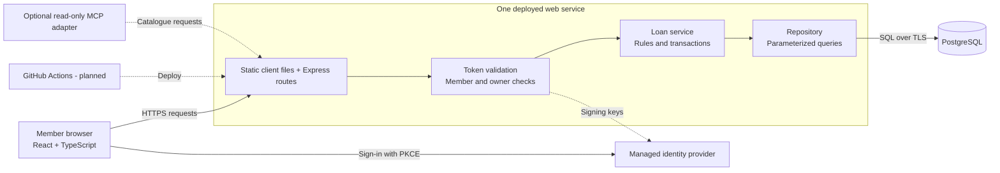
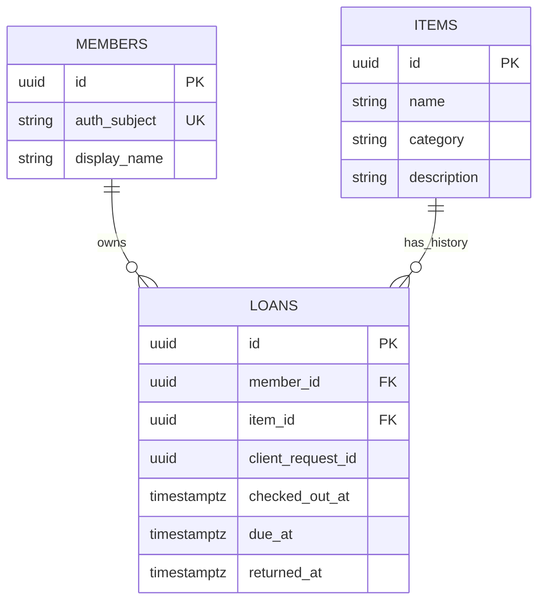

# 2. Architecture

**Owner:** Eli. **API/data owner:** Noor. **Decision status:** proposed Week 3 baseline; validate the risky assumptions in Week 4. Architecture is a set of boundaries and reasons, not just a picture.

**Assignment reference:** [Group application planning requirements](../requirements.md). This document is a worked CampusKit example of the architecture deliverable. Its technology and product choices are illustrative, not requirements for other groups.

## Component boundaries



The browser is an untrusted input boundary. Business requests go through server-side identity, membership, and ownership checks. The database is reachable through the service, not directly from the browser or optional MCP adapter. Dashed arrows show supporting or optional paths.

| Component | Owns | Does not own |
| --- | --- | --- |
| React + TypeScript client | Catalogue, detail, My Loans, forms, loading/errors, accessible focus | Loan authorization, final availability decisions, or database access |
| Node.js + Express + TypeScript service | Request validation, token/member checks, loan rules, transaction boundaries, response contracts | Password storage or model-directed business decisions |
| PostgreSQL | Persistent members/items/loans, foreign keys, uniqueness, atomic commits | UI state or untrusted business decisions from the browser |
| Managed identity provider | Sign-in and API access tokens for synthetic accounts | Permission to read another member's loans |

The Express process serves the production client build and `/api/v1` routes on the **same origin**. That avoids a production cross-origin configuration unless requirements change. It is a modular monolith: route/controller, loan service, and repository modules are separate code responsibilities, not separate deployed services.

**Deployment proposal:** one Render web service and a managed PostgreSQL database, subject to Week 4 pricing and course approval. Local development uses the same database engine, with disposable seeded data. A process-local array or an ephemeral file is not production persistence.

## Data model



Each member and each item may have many historical loans. The diagram does not express the conditional uniqueness rule: an item can have only one **active** loan. That rule and the composite member/request-key uniqueness constraint are defined below.

| Entity | Important fields | Constraints |
| --- | --- | --- |
| `members` | `id`, `auth_subject`, `display_name` | UUID primary key; identity-provider subject is unique; no passwords |
| `items` | `id`, `name`, `category`, `description` | UUID primary key; category is camera, audio, or accessory |
| `loans` | `id`, `member_id`, `item_id`, `client_request_id`, `checked_out_at`, `due_at`, `returned_at` | UUID primary key and foreign keys; unique retry key per member; at most one active loan per item |

`returned_at` is null until return. API `status` is derived: null means `active`, otherwise `returned`. Item `available` is derived from the absence of an active loan. We do **not** also store a separately editable availability flag that can drift out of sync.

All timestamps use PostgreSQL `timestamptz`. The server supplies them, normalizes to whole seconds before persistence, and serializes with a UTC `Z` suffix. Database checks enforce `due_at > checked_out_at` and a non-null `returned_at >= checked_out_at`. The member and item foreign keys are non-null and restrict deletion while referenced.

### A business invariant needs database support

An invariant is a rule that must always remain true: here, a physical item cannot have two active loans.

```sql
CREATE UNIQUE INDEX one_active_loan_per_item
ON loans (item_id)
WHERE returned_at IS NULL;

CREATE UNIQUE INDEX loan_request_per_member
ON loans (member_id, client_request_id);
```

This is **proposed schema SQL**, to be exercised against PostgreSQL in the Week 4 spike. Disabling the Borrow button is good UX but cannot prevent two browsers from racing.

An item has many historical loans, not many simultaneous active loans. The MVP never deletes loans, so the retry key remains attached for the life of that record. These constraints are part of the design contract, not evidence that migrations have already run.

## Borrow transaction and failure boundaries

```mermaid
sequenceDiagram
    participant Browser
    participant API
    participant LoanService as Loan service
    participant DB as PostgreSQL
    Browser->>API: POST /api/v1/loans with itemId and clientRequestId
    API->>API: Validate identity, member, quota, and request
    API->>LoanService: Borrow for the authenticated member
    LoanService->>DB: Resolve retry key or insert in transaction
    Note over DB: Enforce one active loan per item
    DB-->>LoanService: Committed loan or uniqueness conflict
    LoanService-->>API: New loan, recognized retry, or conflict
    API-->>Browser: 201 new / 200 replay / 409 conflict
    Note over Browser,API: Lost response means unknown outcome; reuse the key
```

The sequence is a design walkthrough, not captured traffic. Authentication, validation, and dependency failures have their own responses in the [API contract](03-api-contract.md).

1. Validate the access token, map its `sub` to a provisioned member, and validate the request shape. Never trust a `memberId` in a request body.
2. Look for that member's `clientRequestId`. If it exists for the same item, return the existing loan's current state with **200**. If it names a different item, return **409 IDEMPOTENCY_CONFLICT**.
3. For a new key, verify the item exists and insert the loan in a transaction. The database's partial unique index arbitrates competing borrowers.
4. After commit, return **201**, a `Location` header, and the loan. On a uniqueness race, roll back the failed attempt and re-read the member/key first: a concurrent retry may already have created the correct loan.
5. Only an actual active-item conflict maps to **409 ITEM_UNAVAILABLE**. A database outage maps to **503**; an unexpected defect maps to **500**. Do not disguise arbitrary database failures as normal conflicts.

The browser creates and retains the key for one borrow intent. If a response is lost, the outcome is **unknown**, not necessarily failed. It offers a same-key retry or a My Loans reconciliation; it must not silently manufacture a new key and repeat the operation. A request correlation ID in logs is a different identifier with a different purpose. This applies the Week 2 discussion of uncertain writes. [S3]

**Return:** authorize ownership and update `returned_at` only if it is still null, in an atomic operation. A retry returns the current returned loan with its original return time. Ownership is checked even when the loan is already returned.

## Identity, secrets, and operations

The proposed identity integration is an Auth0 development tenant with an official SPA SDK and Authorization Code + PKCE. Use synthetic accounts and disable public signup for the demonstration. The browser holds the API access token in memory, not in local storage; a browser SPA does not receive a client secret. This is a selected design to spike, not an assumption that tenant access or a free plan is guaranteed.

The API checks the token's signature using an explicitly allowed signing algorithm, expected issuer, audience, and expiry, then resolves the subject to a seeded member. The subject is meaningful within that one configured issuer, not across arbitrary tenants; changing issuers requires an explicit member migration. A valid identity with no club-member record receives **403**. No role claim or user-controlled ID bypasses the loan ownership checks. Missing or invalid credentials receive **401**. A required identity-key fetch that cannot complete without a usable cached key is a dependency failure, not an empty catalogue.

Server-side configuration includes `DATABASE_URL`, the expected token issuer, and the API audience. Client-visible configuration contains only public identifiers such as the SPA client ID. Secrets live in approved deployment/CI secret storage, not Markdown, source control, screenshots, logs, or AI prompts.

Structured logs record request ID, route, status, and elapsed time, without tokens or full request bodies. Week 7 adds an error-rate alert, a synthetic health check, cost tracking, and deployment automation. `GET /healthz` is a public **liveness** check only; a separate authenticated catalogue smoke test verifies database and identity integration. A green liveness response is not proof that borrowing works.

The per-member request quota is not a full abuse-defense system: invalid/unmapped identities and public health requests do not consume a member quota. Week 8 reviews separate edge protections, input-size limits, dependency behavior, and logging without turning a classroom policy into a claim of production security.

## Architecture decisions and tradeoffs

| Decision | Chosen approach and reason | Tradeoff / revisit condition |
| --- | --- | --- |
| ADR-01: deployment shape | Modular monolith. One team and one workflow do not justify multiple independently deployed services | Coupled releases; revisit only if independent scaling or team ownership becomes a real need |
| ADR-02: persistence | PostgreSQL in development and cloud. Transactions, foreign keys, and a partial unique index protect lending rules | More setup and hosting cost than an in-memory demo; verify tooling and price early |
| ADR-03: authentication | Managed OIDC plus server-side ownership checks. Avoid building password lifecycle features | Provider availability, token configuration, and synthetic-account setup are real dependencies |
| ADR-04: HTTP before MCP | Deterministic UI calls the API. Optional read-only adapter reuses its authorization and contracts | Gives up an AI interaction in the MVP, but reduces moving parts and privacy exposure |

### MCP: a justified omission, not a forgotten topic

The course's Week 2 MCP module explicitly discusses when **not** to add it. The core CampusKit workflow is a fixed UI interaction, so a direct API is simpler. [S3]

If the MVP is stable, a time-boxed optional spike could expose `search_available_items` for an approved assistant host. The host's MCP client invokes the adapter; the adapter calls the existing catalogue API with appropriately scoped access, returns a bounded result and source, and does not connect directly to the database.

The optional version must expose **no borrow, return, write, or administrative capability**. It must report failure rather than claiming that no items exist, preserve the user's authorization, and treat retrieved text as data rather than instructions. A read-only label is not a sandbox and does not make private data safe to send to a model. Tool correctness and the model's summary quality are separate tests.

### Week 4 technical spikes

| Spike | Owner and time box | Decision evidence |
| --- | --- | --- |
| Token/member integration | Eli, 2 hours | One valid synthetic member accepted; wrong audience, expiry, and unprovisioned membership rejected |
| Lending concurrency and retry | Noor, 2 hours | Parallel attempts create one active loan; same-key retries resolve to one loan ID |
| Deployment persistence | Eli, 2 hours | A seeded record survives a web-service restart in the candidate environment; estimated cost is documented |

A spike has an output and a deadline, not an indefinite "research" task. If managed auth or hosting is blocked, Eli brings a specific alternative to the instructor by the end of Week 4; the team does not publish an unauthenticated substitute.

[S3]: ../sources.md#s3-week-2-planning-workflow-and-mcp
